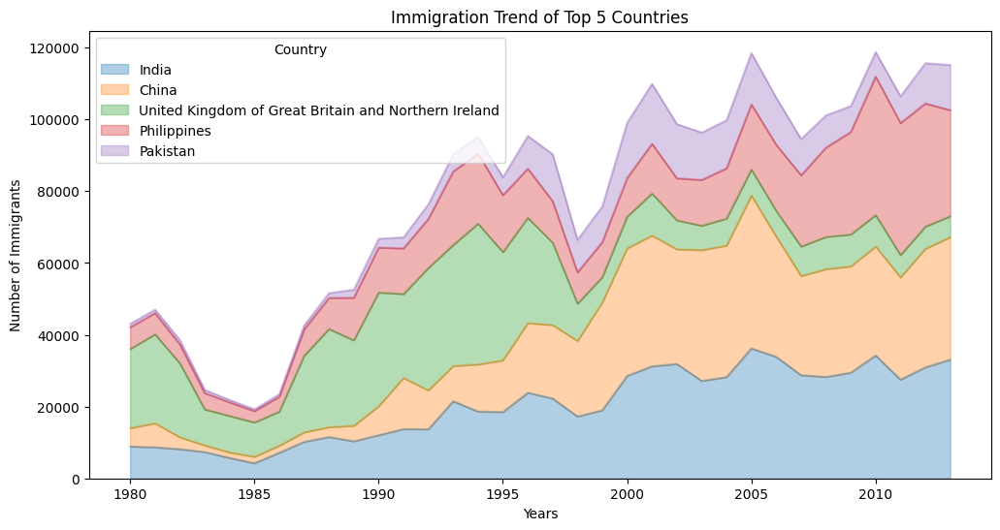
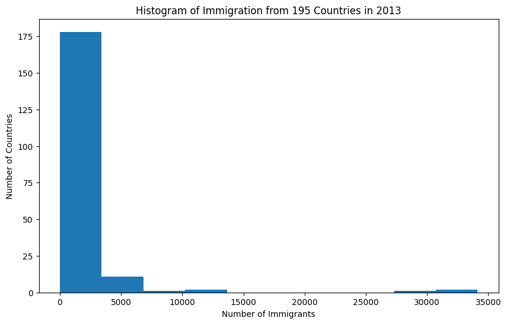
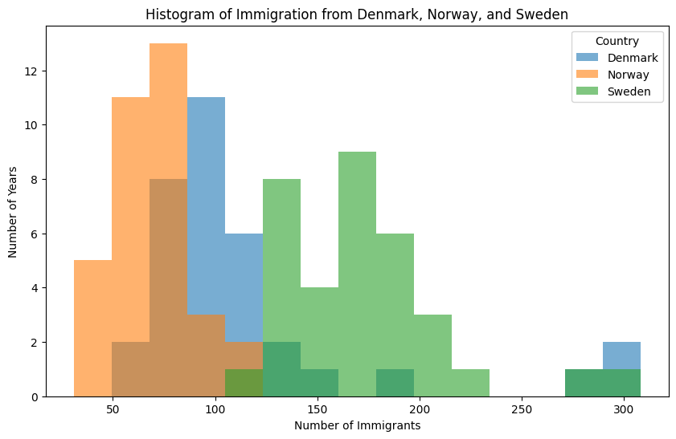
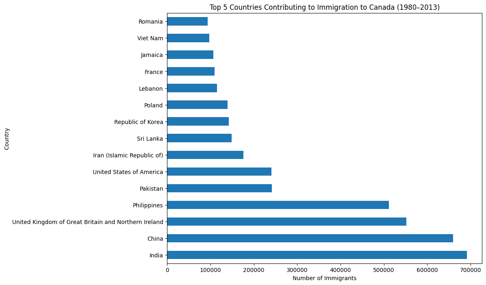
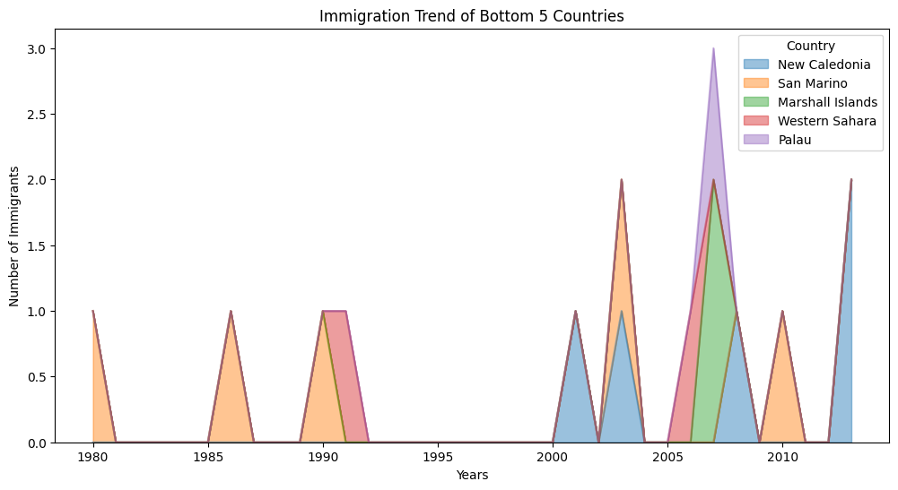

# canada-immigration-data-visualization
Explored immigration trends to Canada (1980–2013) using Python and data visualization techniques. Built area plots, histograms, and bar charts to uncover patterns and communicate insights clearly.
# Canada Immigration Data Visualization

## Overview

What does immigration to Canada actually look like when you move beyond raw numbers?

In this project, I explored immigration trends from 1980 to 2013 across 195 countries using Python and data visualization. The goal wasn’t just to create charts, but to understand how patterns emerge over time and how data can be communicated clearly for decision-making.

---

## Why This Project

Coming from a UX and product design background, I’m interested in how data can support better understanding — not just analysis.

This project focuses on:
- Turning raw data into clear visual narratives
- Identifying patterns across countries and time
- Communicating insights in a way that reduces cognitive load

---

## Tools & Technologies

- Python
- Pandas
- NumPy
- Matplotlib
- Google Colab

---

## Key Visualizations & Insights

### 1. Immigration Trends Over Time (Top 5 Countries)

A small number of countries contribute a large proportion of immigrants to Canada.  
India and China show consistent long-term growth, while others fluctuate more over time.

---

### 2. Long Tail Distribution (2013)

Most countries contribute relatively low numbers of immigrants, while a few contribute very high volumes.  
This creates a highly skewed distribution — a classic “long tail” pattern.

---

### 3. Country Comparison (Denmark, Norway, Sweden)

Comparing similar countries reveals differences in distribution patterns.  
Sweden shows higher variability and peaks compared to Denmark and Norway.

---

### 4. Top Contributors to Immigration

The gap between the top countries and others is significant.  
India, China, and the UK dominate overall immigration contributions.

---

### 5. Minimal Contribution Countries

Some countries contribute very low immigration numbers across all years.  
This highlights how uneven global immigration distribution is.

---

## Key Takeaways

- Immigration patterns are highly concentrated among a small number of countries  
- Data distributions are skewed, not evenly spread  
- Visualizing time-series data reveals trends that raw tables cannot  
- Clear visualization reduces complexity and improves interpretability  

---

## Dataset

Canada Immigration Dataset (1980–2013)  
Contains immigration counts by country per year.

---

## Project Files

- `Area_Plots_Histograms_Bar_Charts_Canada_Immigration.ipynb` — Full analysis notebook  
- `Canada.csv` — Dataset  
- Visualization images included for quick reference  

---

## Reflection

This project reinforced how important visualization is in making data understandable.

As someone working at the intersection of UX, AI, and analytics, I’m particularly interested in how:
- data can be translated into intuitive interfaces  
- insights can be communicated clearly  
- and complex systems can become easier to interpret through design  

---
